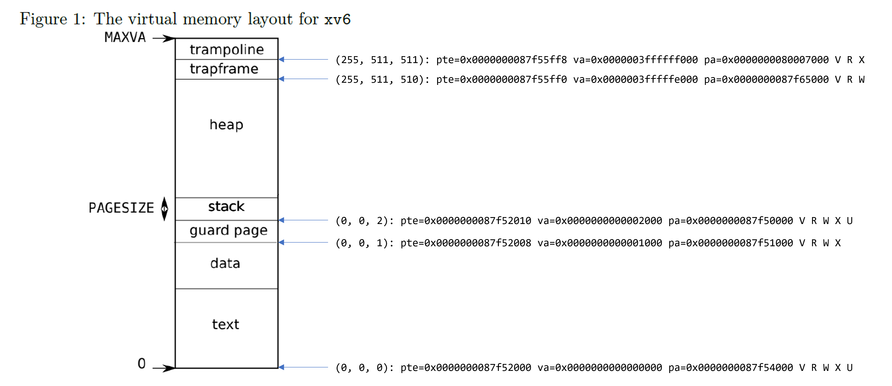
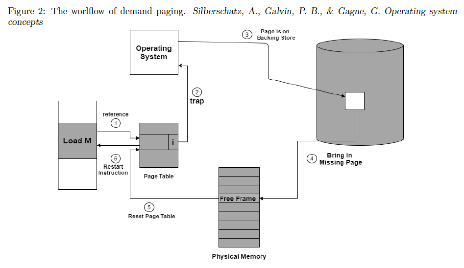

# Virtual Memory Management - Report

Student ID: r11922001

1. Explain how `pte`, `pa` and `va` values are obtained in detail. Write down the calculation formula for `va`.

   In sv39 multilevel pagetable implementation, each level is an array stores PTEs with fixed-size 512. Given address of `pagetable`, we search non-empty entires (marked with flag `PTE_V` or `PTE_S`) inside the array, and print the physical address of non-empty entry as `pte`. After non-empty entires are found, convert the content of entries by `PTE2PA()`, obtain `pa`. Furthermore, `va` = `PGSIZE * (i << 18 + j << 9 + k)`, where `i`, `j` and `k` are index of PTE from level-2, level-1 and level-0 pagetable, respectively.

2. Write down the correspondences from the page table entries printed by `mp2_1` to the memory sections in Figure 1. Explain the rationale of the correspondence. Please take virtual addresses and flags into consideration.

    The correspondences are annotated in the figure below. Index `(i, j, k)` in front of the table entries corresponds to index of PTE from level-2, level-1 and level-0 pagetable, respectively.

    From `va`, we can infer that the pages with `va` near to `MAXVA` are trapframe and trampoline, and page with `va=0x0` belongs to text section. Page (0, 0, 2) belongs to user but (0, 0, 1) does not. Therefore, we can infer that page (0, 0, 2) is stack, and page (0, 0, 1) is guard page.

    

3. Make a comparison between the inverted page table in textbook and multilevel page table in the following aspects: (a) Memory space usage, (b) Lookup time / efficiency of the implementation.

    1. Memory space usage:
        - Inverted page table: Proportion to RAM (+swap) size, independent to number of processes running in machine.
        - Multi-level page table: Sum of page tables allocated by each process, extra memory consumption when level-2 and level-1 page table are needed.

    2. Lookup time:
       - Inverted page table: claimed $\mathcal{O}(1)$ lookup time with hashing, increases to linear time when hash collision occurred frequently.
       - Multi-level page table: constant depth of page table leads $\mathcal{O}(1)$ lookup time.

4. In which steps the page table is changed? How are the addresses and flag bits modified in the page table?

    In step 5 the page table is changed. The page table entry is modified as physical address of page, `PTE_S` is reset, `PTE_V` is set.

    

5. Describe the procedure of each step in plain English in Figure 2. Also, include the functions to be called in your implementation if any.

    1. User process dereferences a virtual address, thus OS queries the corresponding physical address from page table.

    2. From the response of page table querying, the page is swapped out, this leads an interrupt / usertrap, which set `sstatus` as 13 or 15 then triggers handler `usertrap()`.

    3. After some condition checking, routine `handle_pgfault()` is triggered. From `stval` we received the virtual address which user process dereferences. Using the virtual address, we query from page table to obtain the block number where page swapped to.

    4. OS allocates a page from free frame list via `kalloc()`, then pass it to `read_page_from_disk()` to bring the page back to disk. Free block with `bfree()` after read instruction is done.

    5. Update PTE, such that it bookmarks a valid mapping from virtual address to physical address.

    6. Finish swap-in handling, restart instruction.
