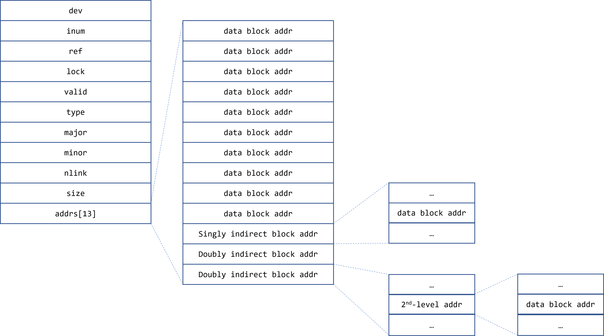

# Report

1. Please draw your inode block structure and explain how to access 66666th block in your implementation.

    The block structure combines 10x directed block, 1x 1-level indirected block and 2x 2-level indirected block.

    

2. Function `symlink(”/b”, ”/a”)` creates a symbolic link `/a` links to file `/b`, explain how to open symbolic link `/a`.

    Assume open symbolic link without `O_NOFOLLOW`, the kernel will first open the inode of `/a` via function call `namei()` in fs, then load the file `/a` and read the string storing in file (assume `/b` here). After that, close inode for `/a` and try to open `/b` via `namei()`.

3. Function `symlink(”/y/”, ”/x/a/”)` creates a symbolic link `/x/a` links to directory `/y/`, explain how to write to `/x/a/b`.

    Assume open symbolic link without `O_NOFOLLOW`, the kernel traverses the directory hierarchy from root, then `x`, `a` and finally `b`, each of the file directory is an inode. Specifically,
    - the kernel opens `/x` from root, checked that `a` is inside `/x/`, so the kernel opens `/x/a`
    - the kernel finds that `/x/a` is a symbolic link, so it reads the file content (assume `/y/` here)
    - the kernel switches to `/y/` and expected to find the remained part `b` inside `/y`.
    - `/y/b/` exists, so the inode for `/y/b/` is returned when user opens `/x/a/b`, then all of the syscall `write()` to `/x/a/b` is actually manipulating `/y/b`
